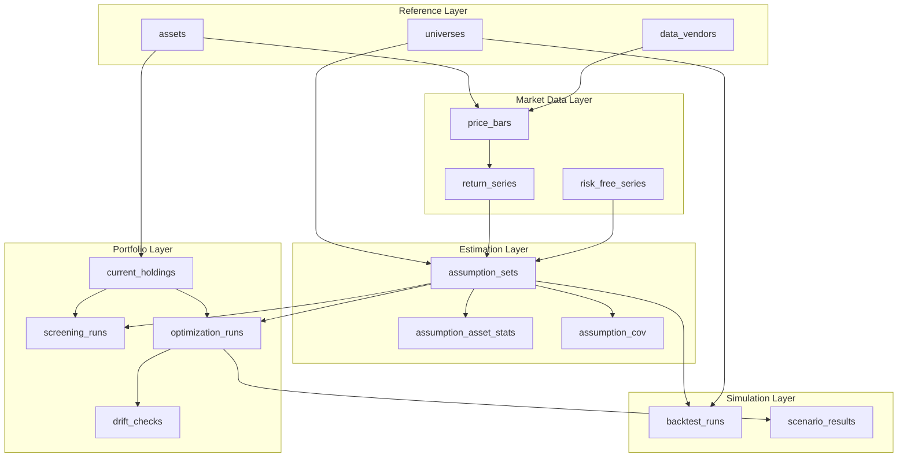

# Entity Relationship Diagram

## Overview

This diagram shows the core entities, their relationships, and cardinality. The system follows a layered data model:

1. **Reference Layer** — Assets, universes, vendors (slowly changing)
2. **Market Data Layer** — Price bars, returns, risk-free rates (append-only)
3. **Estimation Layer** — Assumption sets with computed μ, Σ (versioned snapshots)
4. **Portfolio Layer** — Current holdings, screening, optimization, drift (user-driven)
5. **Simulation Layer** — Backtests (derived from portfolio + market data)

---

## Core ER Diagram

```mermaid
erDiagram
    %% ===================
    %% REFERENCE LAYER
    %% ===================
    
    assets {
        uuid asset_id PK
        text ticker UK
        text name
        text asset_class "equity|fixed_income|commodity|..."
        text sub_class
        text sector "GICS sector (nullable)"
        text geography "us|developed_ex_us|emerging|global"
        text currency "ISO 4217"
        bool is_etf
        timestamptz created_at
    }
    
    universes {
        uuid universe_id PK
        text name UK
        text description
        text universe_type "active|candidate_pool"
        timestamptz created_at
    }
    
    universe_assets {
        uuid universe_id FK
        uuid asset_id FK
        bool is_benchmark "default false"
    }
    
    data_vendors {
        uuid vendor_id PK
        text name UK
        text notes
    }
    
    %% ===================
    %% MARKET DATA LAYER
    %% ===================
    
    price_bars {
        uuid asset_id FK
        uuid vendor_id FK
        date bar_date
        text frequency "daily|weekly|monthly"
        float adj_close
        float close "nullable"
        bigint volume "nullable"
        timestamptz pulled_at
    }
    
    return_series {
        uuid asset_id FK
        date bar_date
        text frequency
        text return_type "simple|log"
        float ret
    }
    
    risk_free_series {
        uuid series_id PK
        text source
        text series_code
        date obs_date
        float rf_annual
    }
    
    %% ===================
    %% ESTIMATION LAYER
    %% ===================
    
    assumption_sets {
        uuid assumption_id PK
        uuid universe_id FK
        text frequency
        text return_type "simple|log"
        date lookback_start
        date lookback_end
        int annualization_factor
        float rf_annual
        text estimator "historical|ewma|shrinkage"
        text cov_method "sample|ledoit_wolf|nearest_psd"
        bool psd_repair_applied
        text psd_repair_note "nullable"
        timestamptz created_at
    }
    
    assumption_asset_stats {
        uuid assumption_id FK
        uuid asset_id FK
        float mu_annual
        float sigma_annual
    }
    
    assumption_cov {
        uuid assumption_id FK
        uuid asset_id_i FK
        uuid asset_id_j FK
        float cov_annual
    }
    
    %% ===================
    %% PORTFOLIO LAYER
    %% ===================
    
    current_holdings_snapshots {
        uuid snapshot_id PK
        text label
        date snapshot_date
        timestamptz created_at
    }
    
    current_holdings_positions {
        uuid snapshot_id FK
        uuid asset_id FK
        float weight "sum to 1"
        float market_value "nullable"
    }
    
    screening_runs {
        uuid screening_id PK
        uuid assumption_id FK
        uuid candidate_pool_id FK "universe_type=candidate_pool"
        text reference_type "current_holdings|seed_universe"
        uuid reference_snapshot_id FK "nullable, conditional"
        uuid reference_universe_id FK "nullable, conditional"
        float nominal_add_weight "default 0.05"
        jsonb score_weights
        timestamptz created_at
    }
    
    screening_scores {
        uuid screening_id FK
        uuid asset_id FK
        float avg_pairwise_corr
        float marginal_vol_reduction
        float sector_gap_score
        float hhi_reduction
        float composite_score
        int rank
        text explanation
    }
    
    optimization_runs {
        uuid run_id PK
        uuid assumption_id FK
        text run_type "MVP|FRONTIER_POINT|FRONTIER_SERIES|TANGENCY"
        text objective "MIN_VAR|MAX_SHARPE"
        jsonb constraints
        uuid reference_snapshot_id FK "nullable"
        float target_return "nullable"
        text status "SUCCESS|INFEASIBLE|ERROR"
        text infeasibility_reason "nullable"
        jsonb solver_meta "nullable"
        timestamptz created_at
    }
    
    optimization_results {
        uuid run_id FK
        float exp_return
        float variance
        float stdev
        float sharpe "nullable"
        float hhi
        float effective_n
        text explanation
    }
    
    optimization_weights {
        uuid run_id FK
        uuid asset_id FK
        float weight
        float mcr
        float crc
        float prc
    }
    
    drift_checks {
        uuid drift_id PK
        uuid run_id FK
        date check_date
        float threshold_pct "default 0.05"
        bool any_breach
        timestamptz created_at
    }
    
    drift_check_positions {
        uuid drift_id FK
        uuid asset_id FK
        float target_weight
        float current_weight
        float drift_abs
        bool breached
        text explanation "required if breached"
    }
    
    %% ===================
    %% SIMULATION LAYER
    %% ===================
    
    backtest_runs {
        uuid backtest_id PK
        uuid universe_id FK
        uuid benchmark_asset_id FK "nullable"
        text strategy "TANGENCY_REBAL|MVP_REBAL|EW_REBAL"
        text rebal_freq "monthly|quarterly|threshold"
        float rebal_threshold "nullable"
        int window_length
        float transaction_cost_bps
        jsonb constraints
        text survivorship_bias_note
        timestamptz created_at
    }
    
    backtest_points {
        uuid backtest_id FK
        date obs_date
        float portfolio_value
        float portfolio_ret
        float portfolio_ret_net
        float benchmark_ret "nullable"
        float active_ret "nullable"
        float turnover "0 on non-rebal"
        float drawdown
    }
    
    backtest_summary {
        uuid backtest_id FK
        float total_return
        float annualized_return
        float annualized_vol
        float sharpe
        float max_drawdown
        float var_95
        float cvar_95
        float avg_turnover
        float tracking_error "nullable"
        float information_ratio "nullable"
    }
    
    scenario_definitions {
        uuid scenario_id PK
        text name
        jsonb shocks
        timestamptz created_at
    }
    
    scenario_results {
        uuid result_id PK
        uuid run_id FK
        uuid scenario_id FK
        float shocked_return
        float shocked_vol "nullable"
        timestamptz created_at
    }
    
    %% ===================
    %% RELATIONSHIPS
    %% ===================
    
    %% Reference relationships
    universes ||--o{ universe_assets : contains
    assets ||--o{ universe_assets : "belongs to"
    
    %% Market data relationships
    assets ||--o{ price_bars : "has prices"
    data_vendors ||--o{ price_bars : "provides"
    assets ||--o{ return_series : "has returns"
    
    %% Estimation relationships
    universes ||--o{ assumption_sets : "defines scope"
    assumption_sets ||--o{ assumption_asset_stats : "contains stats"
    assumption_sets ||--o{ assumption_cov : "contains covariances"
    assets ||--o{ assumption_asset_stats : "stats for"
    assets ||--o{ assumption_cov : "covariance pair"
    
    %% Holdings relationships
    current_holdings_snapshots ||--o{ current_holdings_positions : contains
    assets ||--o{ current_holdings_positions : "held in"
    
    %% Screening relationships
    assumption_sets ||--o{ screening_runs : "basis for"
    universes ||--o{ screening_runs : "candidate pool"
    current_holdings_snapshots ||--o| screening_runs : "reference (conditional)"
    universes ||--o| screening_runs : "seed universe (conditional)"
    screening_runs ||--o{ screening_scores : produces
    assets ||--o{ screening_scores : "scored"
    
    %% Optimization relationships
    assumption_sets ||--o{ optimization_runs : "basis for"
    current_holdings_snapshots ||--o| optimization_runs : "turnover reference"
    optimization_runs ||--|| optimization_results : "has result"
    optimization_runs ||--o{ optimization_weights : "produces weights"
    assets ||--o{ optimization_weights : "weight for"
    
    %% Drift relationships
    optimization_runs ||--o{ drift_checks : "target for"
    drift_checks ||--o{ drift_check_positions : contains
    assets ||--o{ drift_check_positions : "drift for"
    
    %% Backtest relationships
    universes ||--o{ backtest_runs : "universe for"
    assets ||--o| backtest_runs : "benchmark"
    backtest_runs ||--o{ backtest_points : "time series"
    backtest_runs ||--|| backtest_summary : "summary stats"
    
    %% Scenario relationships
    optimization_runs ||--o{ scenario_results : "stressed"
    scenario_definitions ||--o{ scenario_results : "applied to"
```

---

## Conditional FK Logic

### screening_runs

The `reference_type` discriminator determines which FK is populated:

| reference_type | reference_snapshot_id | reference_universe_id |
|----------------|----------------------|----------------------|
| `current_holdings` | NOT NULL (FK to current_holdings_snapshots) | NULL |
| `seed_universe` | NULL | NOT NULL (FK to universes) |

**Constraint:** Exactly one of the two FKs must be non-null, matching the discriminator.

### optimization_runs

The `reference_snapshot_id` is optional. When present, it enables turnover constraints against current holdings. When absent, turnover constraints fall back to the previous optimization run for the same universe, or are ignored if no prior run exists.

---

## Cardinality Summary

| Relationship | Cardinality | Notes |
|--------------|-------------|-------|
| universe → universe_assets | 1:N | A universe contains many assets |
| asset → universe_assets | 1:N | An asset can belong to many universes |
| assumption_set → optimization_runs | 1:N | One assumption set can drive many optimizations |
| optimization_run → optimization_results | 1:1 | Every successful run has exactly one result |
| optimization_run → optimization_weights | 1:N | One per asset in the universe |
| optimization_run → drift_checks | 1:N | Can check drift multiple times over time |
| backtest_run → backtest_points | 1:N | One per observation date |
| backtest_run → backtest_summary | 1:1 | Exactly one summary per backtest |

---

## Data Flow

