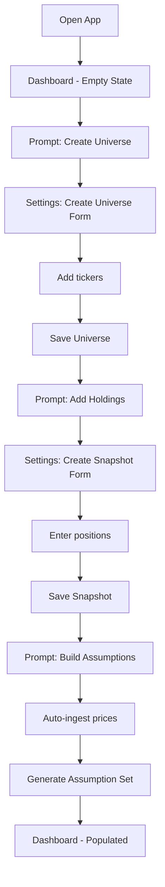
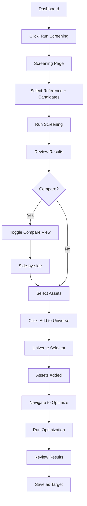
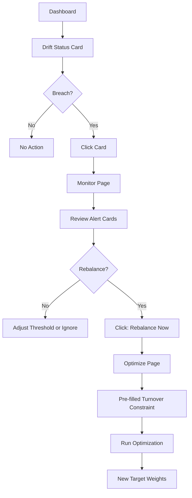
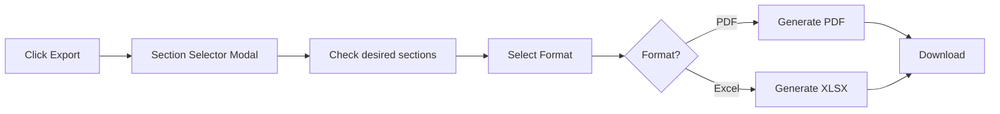

# UI Specification v1

## Overview

This document specifies the user interface for the Portfolio Builder & Risk Analyzer. The UI is built with Streamlit (v1) with a planned React migration path.

### Design Principles

| Principle | Implementation |
|-----------|----------------|
| Bloomberg-inspired | Dark theme, data-dense but organized, professional financial aesthetic |
| Progressive disclosure | Presets visible, advanced options behind toggles |
| Workflow-oriented | Suggested sequential flow, but all sections accessible |
| Results-focused | Hide math, show plain-language explanations and visualizations |

### Technical Stack

- **Framework:** Streamlit 1.x
- **Charts:** Plotly (interactive)
- **Theme:** Dark mode (custom CSS)
- **Layout:** Single page with sidebar navigation
- **Target:** Desktop browsers (1280px+ width)

---

## Navigation Structure

```
┌─────────────────────────────────────────────────────────────────┐
│  [Logo] Portfolio Builder              [Refresh Data] [Export] │
├──────────────┬──────────────────────────────────────────────────┤
│              │                                                  │
│  SIDEBAR     │  MAIN CONTENT AREA                              │
│              │                                                  │
│  Dashboard   │  (Changes based on sidebar selection)           │
│  ──────────  │                                                  │
│  Screening   │                                                  │
│  Optimize    │                                                  │
│  Portfolio   │                                                  │
│  Monitor     │                                                  │
│  Backtest    │                                                  │
│  ──────────  │                                                  │
│  Settings    │                                                  │
│              │                                                  │
└──────────────┴──────────────────────────────────────────────────┘
```

### Sidebar Sections

| Section | Purpose | Icon |
|---------|---------|------|
| Dashboard | Summary stats, quick actions | 📊 |
| Screening | Find diversifying assets | 🔍 |
| Optimize | Build optimal portfolios | ⚡ |
| Portfolio | View current portfolio details | 💼 |
| Monitor | Drift detection, alerts | 📡 |
| Backtest | Historical simulations | 📈 |
| Settings | Universe management, data config | ⚙️ |

---

## Screen Specifications

### 1. Dashboard

**Purpose:** At-a-glance summary, entry point to workflows.

**Layout:**
```
┌─────────────────────────────────────────────────────────────────┐
│  DASHBOARD                                          [Refresh]  │
├─────────────────────────────────────────────────────────────────┤
│                                                                 │
│  ┌──────────────┐ ┌──────────────┐ ┌──────────────┐            │
│  │ PORTFOLIO    │ │ DRIFT STATUS │ │ LAST UPDATE  │            │
│  │ $1,234,567   │ │ ✓ In Range   │ │ 2 hours ago  │            │
│  │ +2.4% MTD    │ │ 0 breaches   │ │ Auto: 6:00AM │            │
│  └──────────────┘ └──────────────┘ └──────────────┘            │
│                                                                 │
│  ┌─────────────────────────────┐ ┌─────────────────────────────┐│
│  │ ALLOCATION                  │ │ RISK METRICS               ││
│  │ [Pie chart - weights]       │ │ VaR 95%: -2.1%             ││
│  │                             │ │ Vol: 12.4%                 ││
│  │                             │ │ Sharpe: 0.82               ││
│  └─────────────────────────────┘ └─────────────────────────────┘│
│                                                                 │
│  ┌─────────────────────────────────────────────────────────────┐│
│  │ QUICK ACTIONS                                               ││
│  │ [Run Screening] [Re-optimize] [Check Drift] [New Backtest] ││
│  └─────────────────────────────────────────────────────────────┘│
│                                                                 │
│  ┌─────────────────────────────────────────────────────────────┐│
│  │ RECENT ACTIVITY                                             ││
│  │ • Optimization completed - 2 hours ago                      ││
│  │ • Drift check passed - 1 day ago                           ││
│  │ • Backtest "Q4 Tangency" completed - 3 days ago            ││
│  └─────────────────────────────────────────────────────────────┘│
│                                                                 │
└─────────────────────────────────────────────────────────────────┘
```

**Components:**

| Component | Type | Data Source |
|-----------|------|-------------|
| Portfolio Value Card | Metric card | Latest holdings snapshot × current prices |
| Drift Status Card | Status card | Latest drift check |
| Last Update Card | Info card | price_bars.pulled_at |
| Allocation Chart | Plotly pie | optimization_weights |
| Risk Metrics Card | Expandable card | optimization_results |
| Quick Actions | Button group | Navigation triggers |
| Recent Activity | List | Aggregated from runs tables |

**Interactions:**
- Cards are clickable → navigate to relevant section
- Quick action buttons → navigate to workflow with action pre-selected
- Refresh button → triggers manual data ingest

---

### 2. Screening

**Purpose:** Score candidate assets against reference portfolio, select for promotion.

**Layout:**
```
┌─────────────────────────────────────────────────────────────────┐
│  SCREENING                                                      │
├─────────────────────────────────────────────────────────────────┤
│                                                                 │
│  CONFIGURATION                                      [Advanced ▼]│
│  ┌─────────────────────────────────────────────────────────────┐│
│  │ Reference: [Current Holdings ▼]  Candidates: [ETF Pool ▼]  ││
│  │ Assumption Set: [2024-01 Daily Historical ▼]                ││
│  │                                            [Run Screening]  ││
│  └─────────────────────────────────────────────────────────────┘│
│                                                                 │
│  RESULTS                               [List View] [Compare ◉] │
│  ┌─────────────────────────────────────────────────────────────┐│
│  │ Rank │ Ticker │ Score │ Corr │ VolRed │ Gap │ HHI │ Select ││
│  │──────┼────────┼───────┼──────┼────────┼─────┼─────┼────────││
│  │  1   │ GLD    │ 0.87  │ 0.92 │ 0.81   │ 1.0 │ 0.76│  [✓]  ││
│  │  2   │ TLT    │ 0.79  │ 0.85 │ 0.72   │ 0.5 │ 0.68│  [ ]  ││
│  │  3   │ VWO    │ 0.71  │ 0.78 │ 0.65   │ 0.5 │ 0.61│  [ ]  ││
│  │ ...  │        │       │      │        │     │     │       ││
│  └─────────────────────────────────────────────────────────────┘│
│                                                                 │
│  EXPLANATION (GLD selected)                                     │
│  ┌─────────────────────────────────────────────────────────────┐│
│  │ "Adding GLD would reduce average pairwise correlation from ││
│  │  0.72 to 0.61 and increase effective N from 3.2 to 4.1.   ││
│  │  Gold fills the commodity asset class, currently absent    ││
│  │  from your portfolio."                                      ││
│  └─────────────────────────────────────────────────────────────┘│
│                                                                 │
│  SELECTED: 2 assets                     [Add to Universe →]    │
│                                                                 │
└─────────────────────────────────────────────────────────────────┘
```

**Advanced Panel (collapsed by default):**
```
┌─────────────────────────────────────────────────────────────────┐
│  Signal Weights           Nominal Add Weight                    │
│  Correlation: [0.40 ←→]   [5% ←→]                              │
│  Vol Reduction: [0.30 ←→]                                       │
│  Sector Gap: [0.15 ←→]                                          │
│  HHI: [0.15 ←→]                                                 │
│                           [Reset to Defaults]                   │
└─────────────────────────────────────────────────────────────────┘
```

**Compare View (toggle):**
```
┌─────────────────────────────────────────────────────────────────┐
│  COMPARE CANDIDATES                                             │
│  ┌───────────────────┐ ┌───────────────────┐ ┌────────────────┐│
│  │ GLD               │ │ TLT               │ │ [+ Add]        ││
│  │ Gold ETF          │ │ 20+ Year Treasury │ │                ││
│  │─────────────────  │ │─────────────────  │ │                ││
│  │ Composite: 0.87   │ │ Composite: 0.79   │ │                ││
│  │ Correlation: 0.92 │ │ Correlation: 0.85 │ │                ││
│  │ Vol Red: 0.81     │ │ Vol Red: 0.72     │ │                ││
│  │ Gap: 1.0          │ │ Gap: 0.5          │ │                ││
│  │ HHI: 0.76         │ │ HHI: 0.68         │ │                ││
│  │                   │ │                   │ │                ││
│  │ Class: Commodity  │ │ Class: Fixed Inc  │ │                ││
│  │ Sector: —         │ │ Sector: —         │ │                ││
│  │                   │ │                   │ │                ││
│  │ [Select]          │ │ [Select]          │ │                ││
│  └───────────────────┘ └───────────────────┘ └────────────────┘│
└─────────────────────────────────────────────────────────────────┘
```

**Interactions:**
- Click row → show explanation below table
- Click checkbox or row → toggle selection
- Toggle List/Compare → switch view modes
- "Add to Universe" → inline universe selector, then navigate to Optimize

---

### 3. Optimize

**Purpose:** Run portfolio optimization, configure constraints, view results.

**Layout:**
```
┌─────────────────────────────────────────────────────────────────┐
│  OPTIMIZE                                                       │
├─────────────────────────────────────────────────────────────────┤
│                                                                 │
│  CONFIGURATION                                      [Advanced ▼]│
│  ┌─────────────────────────────────────────────────────────────┐│
│  │ Universe: [US Core ETFs ▼]                                  ││
│  │ Assumption Set: [2024-01 Daily Historical ▼]                ││
│  │ Objective: ( ) Min Variance  (●) Max Sharpe  ( ) Frontier   ││
│  │ Preset: [Long-only Conservative ▼]                          ││
│  │                                              [Run Optimize] ││
│  └─────────────────────────────────────────────────────────────┘│
│                                                                 │
│  RESULTS                                                        │
│  ┌──────────────────────────────┐ ┌────────────────────────────┐│
│  │ EFFICIENT FRONTIER           │ │ PORTFOLIO SUMMARY          ││
│  │                              │ │                            ││
│  │    *  ← Tangency             │ │ Expected Return: 8.2%      ││
│  │   / \                        │ │ Volatility: 12.4%          ││
│  │  /   \                       │ │ Sharpe: 0.66               ││
│  │ *     \  ← MVP               │ │ Effective N: 4.2           ││
│  │        \                     │ │                            ││
│  │ [Plotly scatter]             │ │ [View Explanation]         ││
│  │                              │ │                            ││
│  └──────────────────────────────┘ └────────────────────────────┘│
│                                                                 │
│  ┌──────────────────────────────┐ ┌────────────────────────────┐│
│  │ WEIGHTS                      │ │ RISK CONTRIBUTION          ││
│  │ [Horizontal bar chart]       │ │ [Horizontal bar chart]     ││
│  │                              │ │                            ││
│  │ VTI ████████████ 35%        │ │ VTI ██████████ 42%         ││
│  │ BND ████████ 25%            │ │ BND ████ 15%               ││
│  │ VEA ██████ 20%              │ │ VEA ██████ 23%             ││
│  │ GLD ████ 12%                │ │ GLD ███ 12%                ││
│  │ TLT ███ 8%                  │ │ TLT ██ 8%                  ││
│  └──────────────────────────────┘ └────────────────────────────┘│
│                                                                 │
│                                    [Save as Target] [Export]    │
│                                                                 │
└─────────────────────────────────────────────────────────────────┘
```

**Advanced Panel:**
```
┌─────────────────────────────────────────────────────────────────┐
│  CONSTRAINTS                                                    │
│  ┌─────────────────────────────────────────────────────────────┐│
│  │ [ ] Long-only          Max Weight: [20% ←──→]               ││
│  │ [ ] Allow shorting     Min Weight: [0% ←──→]                ││
│  │ [ ] Leverage cap       Leverage: [1.0 ←──→]                 ││
│  │ [ ] Turnover cap       Turnover: [— Not set —]              ││
│  │                                                              ││
│  │ Per-Asset Overrides:                                         ││
│  │ VTI: Min [0%] Max [40%]                        [+ Add Rule] ││
│  └─────────────────────────────────────────────────────────────┘│
│                                                                 │
│  TARGET RETURN (for Frontier Point)                             │
│  [──────────●──────────] 8.0%                                   │
│  Min: 4.2%                Max: 12.1%                            │
└─────────────────────────────────────────────────────────────────┘
```

**Frontier Interaction:**
- Hover point → tooltip with return, vol, Sharpe
- Click point → populate weights table with that portfolio
- MVP and Tangency points highlighted with distinct markers/colors

**Infeasible State:**
```
┌─────────────────────────────────────────────────────────────────┐
│  ⚠️ OPTIMIZATION INFEASIBLE                                    │
│  ┌─────────────────────────────────────────────────────────────┐│
│  │ "Target return of 11% exceeds maximum achievable return    ││
│  │  of 8.4% under long-only constraints."                      ││
│  │                                                              ││
│  │ Suggestions:                                                 ││
│  │ • Lower target return to ≤8.4%                              ││
│  │ • Allow shorting to expand feasible region                  ││
│  │ • Add higher-return assets to universe                      ││
│  └─────────────────────────────────────────────────────────────┘│
└─────────────────────────────────────────────────────────────────┘
```

---

### 4. Portfolio

**Purpose:** Detailed view of current portfolio with all visualizations and metrics.

**Layout:**
```
┌─────────────────────────────────────────────────────────────────┐
│  PORTFOLIO                            [As of: 2024-01-15 ▼]    │
├─────────────────────────────────────────────────────────────────┤
│                                                                 │
│  ┌─────────────────────────────────────────────────────────────┐│
│  │ ALLOCATION          │ RISK CONTRIBUTION   │ CORRELATION     ││
│  │ [Pie chart]         │ [Bar chart]         │ [Heatmap]       ││
│  │                     │                     │                 ││
│  │                     │                     │   VTI BND VEA   ││
│  │                     │                     │ VTI 1.0 0.2 0.8 ││
│  │                     │                     │ BND 0.2 1.0 0.1 ││
│  │                     │                     │ VEA 0.8 0.1 1.0 ││
│  └─────────────────────────────────────────────────────────────┘│
│                                                                 │
│  HOLDINGS                                                       │
│  ┌─────────────────────────────────────────────────────────────┐│
│  │ Ticker │ Name          │ Weight │ MCR   │ CRC   │ PRC      ││
│  │────────┼───────────────┼────────┼───────┼───────┼──────────││
│  │ VTI    │ Total Stock   │ 35.0%  │ 0.052 │ 0.018 │ 42.1%    ││
│  │ BND    │ Total Bond    │ 25.0%  │ 0.021 │ 0.005 │ 12.3%    ││
│  │ VEA    │ Developed Intl│ 20.0%  │ 0.048 │ 0.010 │ 22.8%    ││
│  │ GLD    │ Gold          │ 12.0%  │ 0.041 │ 0.005 │ 11.5%    ││
│  │ TLT    │ Long Treasury │  8.0%  │ 0.058 │ 0.005 │ 11.3%    ││
│  │────────┼───────────────┼────────┼───────┼───────┼──────────││
│  │ TOTAL  │               │ 100.0% │       │ 0.043 │ 100.0%   ││
│  └─────────────────────────────────────────────────────────────┘│
│                                                                 │
│  RISK METRICS                                         [Expand ▼]│
│  ┌──────────────┐ ┌──────────────┐ ┌──────────────┐ ┌──────────┐│
│  │ VaR 95%      │ │ CVaR 95%     │ │ Max Drawdown │ │ Vol      ││
│  │ -2.1%        │ │ -3.4%        │ │ -18.2%       │ │ 12.4%    ││
│  │ daily        │ │ daily        │ │ 2022-09      │ │ annual   ││
│  └──────────────┘ └──────────────┘ └──────────────┘ └──────────┘│
│                                                                 │
│  SCENARIO STRESS TESTS                              [+ Custom]  │
│  ┌─────────────────────────────────────────────────────────────┐│
│  │ Scenario             │ Impact    │ Status                   ││
│  │──────────────────────┼───────────┼──────────────────────────││
│  │ Equity Crash -30%    │ -12.4%    │ ██████░░░░ Moderate      ││
│  │ Rate Spike +200bps   │ -4.2%     │ ███░░░░░░░ Low           ││
│  │ Inflation +3%        │ -1.8%     │ ██░░░░░░░░ Low           ││
│  │ 2008 Replay          │ -22.1%    │ ████████░░ High          ││
│  └─────────────────────────────────────────────────────────────┘│
│                                                                 │
└─────────────────────────────────────────────────────────────────┘
```

**Risk Metrics Expanded:**
```
┌─────────────────────────────────────────────────────────────────┐
│  RISK METRICS (Expanded)                             [Collapse] │
│  ┌─────────────────────────────────────────────────────────────┐│
│  │                    │ 95% Confidence │ 99% Confidence        ││
│  │ VaR (daily)        │ -2.1%          │ -3.2%                 ││
│  │ CVaR (daily)       │ -3.4%          │ -4.8%                 ││
│  │                                                              ││
│  │ Drawdown Analysis                                            ││
│  │ [Drawdown time series chart]                                 ││
│  │ Max: -18.2% (Sep 2022)  Avg: -4.1%  Current: -2.3%          ││
│  └─────────────────────────────────────────────────────────────┘│
└─────────────────────────────────────────────────────────────────┘
```

---

### 5. Monitor

**Purpose:** Drift detection dashboard, rebalancing triggers.

**Layout:**
```
┌─────────────────────────────────────────────────────────────────┐
│  MONITOR                                                        │
├─────────────────────────────────────────────────────────────────┤
│                                                                 │
│  DRIFT STATUS                                      [Check Now]  │
│  ┌─────────────────────────────────────────────────────────────┐│
│  │ Last Check: 2024-01-15 09:00    Threshold: ±5%              ││
│  │ Target From: Optimization 2024-01-01                        ││
│  └─────────────────────────────────────────────────────────────┘│
│                                                                 │
│  ALERTS                                                         │
│  ┌───────────────────────────────┐ ┌───────────────────────────┐│
│  │ ⚠️ VTI BREACH                 │ │ ✓ BND In Range           ││
│  │ Target: 35.0%                 │ │ Target: 25.0%             ││
│  │ Current: 41.2%                │ │ Current: 23.8%            ││
│  │ Drift: +6.2%                  │ │ Drift: -1.2%              ││
│  │                               │ │                           ││
│  │ "VTI has grown from 35% to   │ │                           ││
│  │  41.2% due to price          │ │                           ││
│  │  appreciation since last     │ │                           ││
│  │  rebalance."                 │ │                           ││
│  └───────────────────────────────┘ └───────────────────────────┘│
│  ┌───────────────────────────────┐ ┌───────────────────────────┐│
│  │ ✓ VEA In Range               │ │ ✓ GLD In Range            ││
│  │ Target: 20.0%                 │ │ Target: 12.0%             ││
│  │ Current: 18.1%                │ │ Current: 10.4%            ││
│  │ Drift: -1.9%                  │ │ Drift: -1.6%              ││
│  └───────────────────────────────┘ └───────────────────────────┘│
│                                                                 │
│  DRIFT HISTORY                                                  │
│  ┌─────────────────────────────────────────────────────────────┐│
│  │ [Line chart: drift per asset over time]                     ││
│  │                                                              ││
│  │ ─── VTI  ─── BND  ─── VEA  ─── GLD                          ││
│  │ --- Threshold bands (±5%)                                    ││
│  └─────────────────────────────────────────────────────────────┘│
│                                                                 │
│  ACTIONS                                                        │
│  ┌─────────────────────────────────────────────────────────────┐│
│  │ 1 breach detected.                                          ││
│  │ [Rebalance Now →] [Adjust Threshold] [Ignore Until...]     ││
│  └─────────────────────────────────────────────────────────────┘│
│                                                                 │
└─────────────────────────────────────────────────────────────────┘
```

**Alert Card States:**

| State | Color | Icon |
|-------|-------|------|
| Breach | Red/Orange | ⚠️ |
| In Range | Green | ✓ |
| Warning (>80% of threshold) | Yellow | ⚡ |

**Interactions:**
- "Check Now" → runs drift check against current prices
- "Rebalance Now" → navigates to Optimize with turnover constraint pre-configured
- Click alert card → expands explanation

---

### 6. Backtest

**Purpose:** Configure and run backtests, compare strategies.

**Layout:**
```
┌─────────────────────────────────────────────────────────────────┐
│  BACKTEST                                                       │
├─────────────────────────────────────────────────────────────────┤
│                                                                 │
│  CONFIGURATION                                      [Advanced ▼]│
│  ┌─────────────────────────────────────────────────────────────┐│
│  │ Universe: [US Core ETFs ▼]  Benchmark: [SPY ▼]              ││
│  │ Strategy: [Tangency Rebalance ▼]                            ││
│  │ Period: [2019-01-01] to [2024-01-01]                        ││
│  │ Preset: [Monthly Rebalance, 10bps cost ▼]                   ││
│  │                                                [Run Backtest]││
│  └─────────────────────────────────────────────────────────────┘│
│                                                                 │
│  RESULTS                          [+ Add Comparison Backtest]   │
│  ┌─────────────────────────────────────────────────────────────┐│
│  │ CUMULATIVE RETURN                                           ││
│  │ [Line chart: portfolio vs benchmark]                        ││
│  │                                                              ││
│  │ ─── Portfolio (Tangency)                                    ││
│  │ ─── Benchmark (SPY)                                         ││
│  │ --- Equal Weight                                             ││
│  └─────────────────────────────────────────────────────────────┘│
│  ┌────────────────────────────┐ ┌──────────────────────────────┐│
│  │ DRAWDOWN                   │ │ ROLLING SHARPE (1Y)          ││
│  │ [Area chart]               │ │ [Line chart]                 ││
│  │                            │ │                              ││
│  └────────────────────────────┘ └──────────────────────────────┘│
│                                                                 │
│  SUMMARY                                                        │
│  ┌─────────────────────────────────────────────────────────────┐│
│  │              │ Portfolio │ Benchmark │ Difference           ││
│  │──────────────┼───────────┼───────────┼──────────────────────││
│  │ Total Return │ +82.4%    │ +71.2%    │ +11.2%               ││
│  │ Ann. Return  │ +12.8%    │ +11.3%    │ +1.5%                ││
│  │ Ann. Vol     │ 14.2%     │ 18.7%     │ -4.5%                ││
│  │ Sharpe       │ 0.90      │ 0.60      │ +0.30                ││
│  │ Max Drawdown │ -18.2%    │ -33.9%    │ +15.7%               ││
│  │ Track. Error │ 8.4%      │ —         │                      ││
│  │ Info. Ratio  │ 0.18      │ —         │                      ││
│  └─────────────────────────────────────────────────────────────┘│
│                                                                 │
│  ⚠️ SURVIVORSHIP BIAS NOTE                                     │
│  ┌─────────────────────────────────────────────────────────────┐│
│  │ This backtest uses current universe composition. Assets    ││
│  │ that were delisted during the period are not included.     ││
│  └─────────────────────────────────────────────────────────────┘│
│                                                                 │
│                                                      [Export]   │
└─────────────────────────────────────────────────────────────────┘
```

**Advanced Panel:**
```
┌─────────────────────────────────────────────────────────────────┐
│  Rebalance Frequency: ( ) Monthly (●) Quarterly ( ) Threshold  │
│  Threshold Drift: [5% ←──→] (if threshold selected)            │
│  Lookback Window: [252 ←──→] trading days                      │
│  Transaction Cost: [10 ←──→] bps                               │
│                                                                 │
│  Constraints: [Same as Optimize section]                        │
└─────────────────────────────────────────────────────────────────┘
```

**Comparison Mode:**
- "Add Comparison" → select another saved backtest
- Charts overlay multiple series with distinct colors
- Summary table adds columns for each backtest

---

### 7. Settings

**Purpose:** Universe management, data configuration, preferences.

**Layout:**
```
┌─────────────────────────────────────────────────────────────────┐
│  SETTINGS                                                       │
├─────────────────────────────────────────────────────────────────┤
│                                                                 │
│  UNIVERSES                                          [+ Create]  │
│  ┌─────────────────────────────────────────────────────────────┐│
│  │ Name           │ Type      │ Assets │ Actions               ││
│  │────────────────┼───────────┼────────┼───────────────────────││
│  │ US Core ETFs   │ Active    │ 8      │ [Edit] [Delete]       ││
│  │ ETF Pool       │ Candidate │ 127    │ [Edit] [Delete]       ││
│  │ Fixed Income   │ Active    │ 5      │ [Edit] [Delete]       ││
│  └─────────────────────────────────────────────────────────────┘│
│                                                                 │
│  CURRENT HOLDINGS                                   [+ Snapshot]│
│  ┌─────────────────────────────────────────────────────────────┐│
│  │ Label             │ Date       │ Assets │ Actions           ││
│  │───────────────────┼────────────┼────────┼───────────────────││
│  │ Brokerage Account │ 2024-01-15 │ 5      │ [View] [Delete]   ││
│  │ IRA               │ 2024-01-10 │ 3      │ [View] [Delete]   ││
│  └─────────────────────────────────────────────────────────────┘│
│                                                                 │
│  DATA REFRESH                                                   │
│  ┌─────────────────────────────────────────────────────────────┐│
│  │ Schedule: [Daily at 6:00 AM ▼]                              ││
│  │ Last Refresh: 2024-01-15 06:00 (Success)                    ││
│  │ Data Vendor: Polygon                                         ││
│  │                                        [Refresh Now] [Logs] ││
│  └─────────────────────────────────────────────────────────────┘│
│                                                                 │
│  EXPORT DEFAULTS                                                │
│  ┌─────────────────────────────────────────────────────────────┐│
│  │ Default Format: [PDF ▼]                                     ││
│  │ Include Sections:                                            ││
│  │ [✓] Executive Summary    [✓] Holdings Table                 ││
│  │ [✓] Risk Metrics         [✓] Charts                         ││
│  │ [ ] Raw Data             [✓] Assumptions                    ││
│  └─────────────────────────────────────────────────────────────┘│
│                                                                 │
└─────────────────────────────────────────────────────────────────┘
```

**Create Universe Modal:**
```
┌─────────────────────────────────────────────────────────────────┐
│  CREATE UNIVERSE                                           [X]  │
│  ┌─────────────────────────────────────────────────────────────┐│
│  │ Name: [________________________]                            ││
│  │ Type: (●) Active  ( ) Candidate Pool                        ││
│  │ Description: [___________________________________]          ││
│  │                                                              ││
│  │ Add Assets:                                                  ││
│  │ [Search ticker... ] [+ Add]                                 ││
│  │                                                              ││
│  │ Selected:                                                    ││
│  │ VTI - Vanguard Total Stock Market         [×]               ││
│  │ BND - Vanguard Total Bond Market          [×]               ││
│  │                                                              ││
│  │                              [Cancel] [Create Universe]      ││
│  └─────────────────────────────────────────────────────────────┘│
└─────────────────────────────────────────────────────────────────┘
```

**Holdings Snapshot Form:**
```
┌─────────────────────────────────────────────────────────────────┐
│  CREATE HOLDINGS SNAPSHOT                                  [X]  │
│  ┌─────────────────────────────────────────────────────────────┐│
│  │ Label: [________________________]                           ││
│  │ Date: [2024-01-15]                                          ││
│  │                                                              ││
│  │ Positions:                                                   ││
│  │ Ticker     Weight (%)                                        ││
│  │ [VTI    ]  [35.0     ]  [×]                                 ││
│  │ [BND    ]  [25.0     ]  [×]                                 ││
│  │ [VEA    ]  [20.0     ]  [×]                                 ││
│  │ [GLD    ]  [12.0     ]  [×]                                 ││
│  │ [TLT    ]  [8.0      ]  [×]                                 ││
│  │ [+ Add Position]                                             ││
│  │                                                              ││
│  │ Total: 100.0% ✓                                             ││
│  │                                                              ││
│  │                                  [Cancel] [Save Snapshot]    ││
│  └─────────────────────────────────────────────────────────────┘│
└─────────────────────────────────────────────────────────────────┘
```

---

## User Flows

### Flow 1: New User Setup



### Flow 2: Screening to Optimization



### Flow 3: Drift Check to Rebalance



---

## Component Library

### Cards

| Type | Usage | States |
|------|-------|--------|
| Metric Card | Single KPI display | Normal, Loading |
| Status Card | Binary status | Success (green), Warning (yellow), Error (red) |
| Alert Card | Drift/breach notification | Breach, Warning, OK |
| Expandable Card | Detailed metrics | Collapsed, Expanded |

### Tables

| Type | Features |
|------|----------|
| Data Table | Sortable columns, row selection, pagination |
| Comparison Table | Side-by-side columns, diff highlighting |
| Summary Table | Aggregated rows, conditional formatting |

### Charts (Plotly)

| Chart | Usage | Config |
|-------|-------|--------|
| Pie | Weight allocation | Interactive legend, hover details |
| Horizontal Bar | Weights, risk contribution | Sorted descending |
| Heatmap | Correlation matrix | Diverging color scale (-1 to +1) |
| Scatter | Efficient frontier | Clickable points, highlighted markers |
| Line | Time series (backtest, drift) | Multi-series, zoom, pan |
| Area | Drawdown | Filled below zero |

### Forms

| Element | Usage |
|---------|-------|
| Dropdown | Universe selection, presets |
| Slider | Numeric constraints, weights |
| Toggle | View modes, advanced panel |
| Date Picker | Backtest range, snapshot date |
| Ticker Search | Autocomplete with asset lookup |

### Feedback

| Type | Trigger |
|------|---------|
| Toast | Async operation complete |
| Inline Error | Validation failure |
| Loading Spinner | During computation |
| Progress Bar | Long-running jobs (backtest) |
| Empty State | No data, with CTA |

---

## Visual Design

### Color Palette (Dark Mode)

| Role | Color | Usage |
|------|-------|-------|
| Background | `#0e1117` | Page background |
| Surface | `#1a1f2c` | Cards, panels |
| Surface Elevated | `#262d3d` | Modals, dropdowns |
| Border | `#3d4663` | Dividers, outlines |
| Text Primary | `#fafafa` | Headings, body |
| Text Secondary | `#8b949e` | Labels, captions |
| Accent | `#58a6ff` | Links, selected items |
| Success | `#3fb950` | Positive values, OK status |
| Warning | `#d29922` | Alerts, caution |
| Error | `#f85149` | Breaches, errors |
| Chart 1 | `#58a6ff` | Primary series |
| Chart 2 | `#3fb950` | Secondary series |
| Chart 3 | `#d29922` | Tertiary series |
| Chart 4 | `#a371f7` | Quaternary series |

### Typography

| Element | Font | Size | Weight |
|---------|------|------|--------|
| Page Title | System Sans | 24px | 600 |
| Section Header | System Sans | 18px | 600 |
| Card Title | System Sans | 14px | 600 |
| Body | System Sans | 14px | 400 |
| Table Data | System Mono | 13px | 400 |
| Caption | System Sans | 12px | 400 |

### Spacing

| Size | Value | Usage |
|------|-------|-------|
| xs | 4px | Inline elements |
| sm | 8px | Related items |
| md | 16px | Card padding |
| lg | 24px | Section gaps |
| xl | 32px | Page margins |

### Layout Grid

- Sidebar: 240px fixed
- Content: Fluid, max 1400px
- Card grid: 2-3 columns responsive
- Gutters: 16px

---

## Export Functionality

### PDF Report Sections

| Section | Contents | Optional |
|---------|----------|----------|
| Executive Summary | Key metrics, status | No |
| Portfolio Holdings | Weights table, allocation chart | No |
| Risk Analysis | VaR, CVaR, drawdown, scenarios | Yes |
| Screening Rationale | Top candidates, explanations | Yes |
| Backtest Results | Performance charts, summary | Yes |
| Assumptions | Universe, lookback, estimators | Yes |

### Excel Workbook Tabs

| Tab | Contents |
|-----|----------|
| Summary | Key metrics |
| Holdings | Weights, MCR, CRC, PRC |
| Covariance | Full matrix |
| Screening | All scores |
| Backtest | Time series data |
| Assumptions | Parameters |

### Export Flow



---

## Loading & Error States

### Loading States

| Context | Display |
|---------|---------|
| Page load | Skeleton cards |
| Table load | Skeleton rows |
| Chart load | Spinner overlay |
| Action button | Button spinner + disable |
| Background refresh | Subtle indicator in header |

### Error States

| Context | Display |
|---------|---------|
| API error | Toast with retry option |
| Validation | Inline field error |
| Infeasible optimization | Dedicated panel with explanation |
| Empty data | Empty state with CTA |
| Network offline | Banner with reconnect status |

### Empty States

| Context | Message | CTA |
|---------|---------|-----|
| No universes | "Create your first universe to get started" | [Create Universe] |
| No holdings | "Add your current holdings to enable screening" | [Add Holdings] |
| No optimizations | "Run an optimization to see your portfolio" | [Go to Optimize] |
| No backtests | "Run a backtest to evaluate strategies" | [New Backtest] |

---

## Accessibility Notes

- All interactive elements keyboard accessible
- Color not sole indicator (icons + text for status)
- Chart data available in table form
- Sufficient contrast ratios (WCAG AA)
- Focus indicators visible

---

## Streamlit Implementation Notes

### Page Structure

```python
# app.py
import streamlit as st

st.set_page_config(
    page_title="Portfolio Builder",
    layout="wide",
    initial_sidebar_state="expanded"
)

# Load custom CSS for dark theme
st.markdown(open("style.css").read(), unsafe_allow_html=True)

# Sidebar navigation
page = st.sidebar.radio(
    "Navigation",
    ["Dashboard", "Screening", "Optimize", "Portfolio", "Monitor", "Backtest", "Settings"]
)

# Route to page
if page == "Dashboard":
    from pages import dashboard
    dashboard.render()
# ... etc
```

### State Management

```python
# Use session_state for:
# - Selected universe
# - Current assumption set
# - Latest optimization run
# - User preferences

if "selected_universe" not in st.session_state:
    st.session_state.selected_universe = None
```

### API Integration

```python
# Use httpx for async API calls
import httpx

async def run_screening(request: dict) -> dict:
    async with httpx.AsyncClient() as client:
        response = await client.post(
            "http://localhost:8000/commands/screening",
            json=request
        )
        return response.json()
```

### Custom Components

For features Streamlit doesn't support natively:
- Clickable Plotly points → use `plotly_events` component
- Complex modals → use `streamlit-modal`
- Better tables → use `st-aggrid`

---

## React Migration Path

When ready to migrate:

1. **API layer stays identical** — React consumes same endpoints
2. **Component mapping:**
   - Streamlit `st.metric` → React card component
   - Streamlit `st.plotly_chart` → React + Plotly.js
   - Streamlit `st.dataframe` → React Table / AG Grid
3. **State management:** Zustand or Redux for global state
4. **Styling:** Tailwind with custom dark theme
5. **Routing:** React Router matching sidebar structure