# Workflow Sequence Diagrams

## Overview

This document provides sequence diagrams for the three core workflows in the Portfolio Builder system. These diagrams show:

1. Which components interact
2. The order of operations
3. Data flow between layers
4. Error handling paths

The diagrams follow CQRS patterns where commands mutate state and queries read state.

---

## Architecture Layers

Before diving into workflows, here's the layer structure:

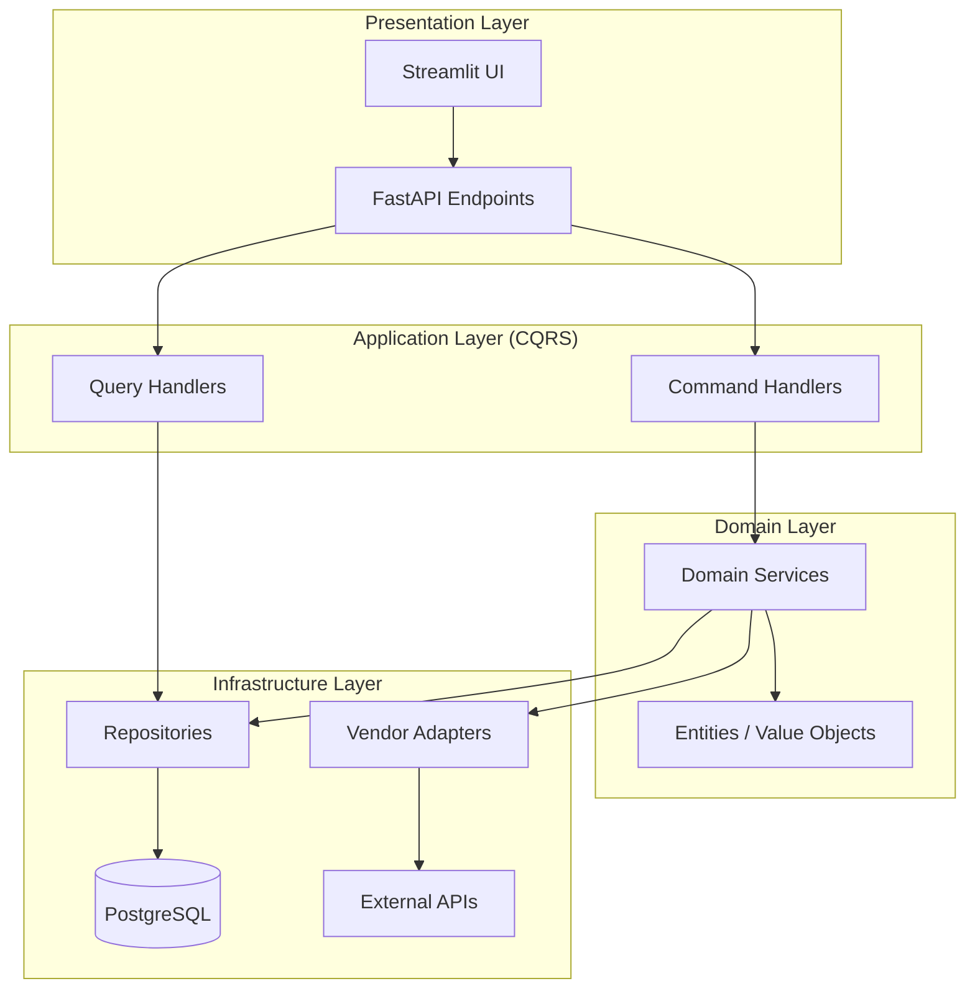

**SOLID Alignment:**
- **Single Responsibility:** Each layer has one reason to change
- **Dependency Inversion:** Upper layers depend on abstractions defined in Domain
- **Open/Closed:** New workflows extend existing handlers without modifying them

---

## Workflow 1: Screening → Promote → Optimize

This is the primary portfolio construction workflow. A user screens candidates, selects assets to add, then optimizes.

### High-Level Flow

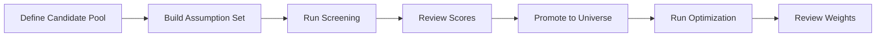

### Detailed Sequence

```mermaid
sequenceDiagram
    autonumber
    participant User
    participant API as FastAPI
    participant CmdH as Command Handler
    participant QryH as Query Handler
    participant ScreenSvc as ScreeningService
    participant OptSvc as OptimizationService
    participant Repo as Repositories
    participant DB as PostgreSQL

    Note over User,DB: Phase 1: Setup Candidate Pool & Assumption Set
    
    User->>API: POST /commands/universes<br/>{name, type: candidate_pool, asset_ids}
    API->>CmdH: CreateUniverseHandler
    CmdH->>Repo: universe_repo.create()
    Repo->>DB: INSERT universes, universe_assets
    DB-->>Repo: universe_id
    Repo-->>CmdH: Universe
    CmdH-->>API: 201 Created
    API-->>User: Universe response

    User->>API: POST /commands/assumptions<br/>{universe_id, lookback, estimator, cov_method}
    API->>CmdH: CreateAssumptionSetHandler
    CmdH->>Repo: return_repo.get_returns(universe_id, window)
    Repo->>DB: SELECT from return_series
    DB-->>Repo: returns[]
    CmdH->>CmdH: Compute μ, Σ
    CmdH->>CmdH: Validate PSD, repair if needed
    CmdH->>Repo: assumption_repo.save(μ, Σ)
    Repo->>DB: INSERT assumption_sets, assumption_asset_stats, assumption_cov
    DB-->>Repo: assumption_id
    Repo-->>CmdH: AssumptionSet
    CmdH-->>API: 201 Created
    API-->>User: AssumptionSet response

    Note over User,DB: Phase 2: Run Screening

    User->>API: POST /commands/screening<br/>{assumption_id, candidate_pool_id, reference_snapshot_id}
    API->>CmdH: RunScreeningHandler
    CmdH->>Repo: holdings_repo.get_snapshot(reference_snapshot_id)
    Repo->>DB: SELECT from current_holdings_positions
    DB-->>Repo: positions[]
    CmdH->>Repo: assumption_repo.get_covariance(assumption_id)
    Repo->>DB: SELECT from assumption_cov
    DB-->>Repo: Σ matrix
    
    CmdH->>ScreenSvc: score_candidates(reference, candidates, Σ)
    
    loop For each candidate
        ScreenSvc->>ScreenSvc: calc_avg_correlation()
        ScreenSvc->>ScreenSvc: calc_marginal_vol_reduction()
        ScreenSvc->>ScreenSvc: calc_sector_gap_score()
        ScreenSvc->>ScreenSvc: calc_hhi_reduction()
        ScreenSvc->>ScreenSvc: compute_composite_score()
        ScreenSvc->>ScreenSvc: generate_explanation()
    end
    
    ScreenSvc->>ScreenSvc: normalize_scores()
    ScreenSvc->>ScreenSvc: rank_candidates()
    ScreenSvc-->>CmdH: ScreeningScores[]
    
    CmdH->>Repo: screening_repo.save(run, scores)
    Repo->>DB: INSERT screening_runs, screening_scores
    DB-->>Repo: screening_id
    Repo-->>CmdH: ScreeningRun
    CmdH-->>API: 201 Created
    API-->>User: ScreeningRun with top candidates

    Note over User,DB: Phase 3: Review & Promote

    User->>API: GET /queries/screening/{id}/scores
    API->>QryH: GetScreeningScoresQuery
    QryH->>Repo: screening_repo.get_scores(id)
    Repo->>DB: SELECT from screening_scores ORDER BY rank
    DB-->>Repo: scores[]
    Repo-->>QryH: ScreeningScore[]
    QryH-->>API: 200 OK
    API-->>User: All candidate scores

    User->>User: Select top candidates to promote

    User->>API: POST /commands/universes/{active_id}/assets<br/>{asset_ids: [selected]}
    API->>CmdH: AddUniverseAssetsHandler
    CmdH->>Repo: universe_repo.add_assets()
    Repo->>DB: INSERT universe_assets
    DB-->>Repo: ok
    Repo-->>CmdH: Universe
    CmdH-->>API: 200 OK
    API-->>User: Updated universe

    Note over User,DB: Phase 4: Optimize

    User->>API: POST /commands/assumptions<br/>{universe_id: active_id, ...}
    API->>CmdH: CreateAssumptionSetHandler
    Note right of CmdH: (Same flow as Phase 1)
    CmdH-->>API: 201 Created
    API-->>User: New AssumptionSet for active universe

    User->>API: POST /commands/optimize<br/>{assumption_id, run_type: TANGENCY, constraints}
    API->>CmdH: RunOptimizationHandler
    CmdH->>Repo: assumption_repo.get_full(assumption_id)
    Repo->>DB: SELECT μ, Σ
    DB-->>Repo: assumption data
    
    CmdH->>OptSvc: optimize(μ, Σ, objective, constraints)
    
    alt Feasible
        OptSvc->>OptSvc: solve_qp()
        OptSvc->>OptSvc: compute_risk_decomposition()
        OptSvc->>OptSvc: generate_explanation()
        OptSvc-->>CmdH: OptimizationResult{weights, mcr, crc, prc}
        CmdH->>Repo: optimization_repo.save(run, result, weights)
        Repo->>DB: INSERT optimization_runs, optimization_results, optimization_weights
        DB-->>Repo: run_id
        Repo-->>CmdH: OptimizationRun
        CmdH-->>API: 201 Created {status: SUCCESS}
    else Infeasible
        OptSvc->>OptSvc: diagnose_infeasibility()
        OptSvc-->>CmdH: InfeasibilityReason
        CmdH->>Repo: optimization_repo.save_infeasible(run, reason)
        Repo->>DB: INSERT optimization_runs {status: INFEASIBLE}
        DB-->>Repo: run_id
        Repo-->>CmdH: OptimizationRun
        CmdH-->>API: 201 Created {status: INFEASIBLE}
    end
    
    API-->>User: OptimizationRun response
```

### Key Decision Points

| Step | Decision | Outcome |
|------|----------|---------|
| Screening reference | Snapshot ID or Universe ID? | Exactly one must be provided |
| PSD validation | Matrix positive semi-definite? | Repair with nearest-PSD if not |
| Optimization feasibility | Solution exists? | Return weights OR infeasibility reason |
| Tangency check | max(μᵢ) > rf? | If not, return INFEASIBLE |

---

## Workflow 2: Optimize → Drift Check → Rebalance Decision

After optimization, users periodically check if their portfolio has drifted from target weights.

### High-Level Flow

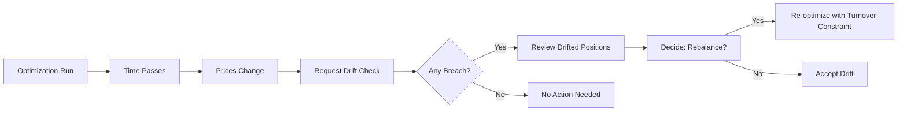

### Detailed Sequence

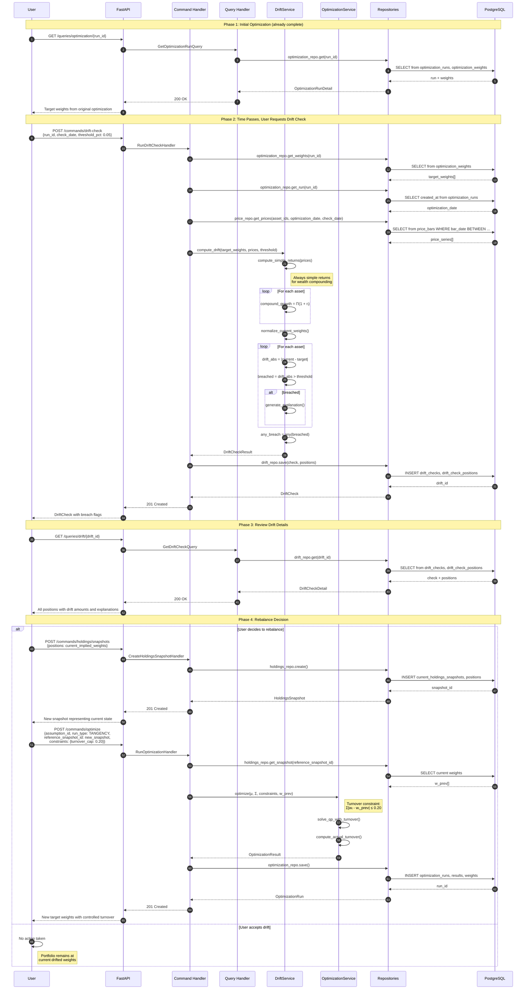

### Drift Detection Logic

```mermaid
flowchart TD
    A[Get Target Weights from Optimization] --> B[Get Price History Since Optimization]
    B --> C[Compute Simple Returns per Asset]
    C --> D[Compound Returns: growth_i = Π(1 + r_i,t)]
    D --> E[Compute Current Implied Weights]
    E --> F[current_i = target_i × growth_i / Σ(target_j × growth_j)]
    F --> G[Compute Drift: |current_i - target_i|]
    G --> H{drift_i > threshold?}
    H -->|Yes| I[Mark Breached + Generate Explanation]
    H -->|No| J[Mark Not Breached]
    I --> K[Aggregate: any_breach = any(breached)]
    J --> K
```

---

## Workflow 3: Backtest Run Lifecycle

Backtesting simulates a strategy over historical data with periodic rebalancing.

### High-Level Flow

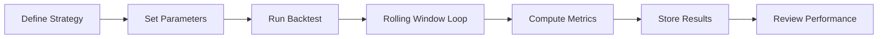

### Detailed Sequence

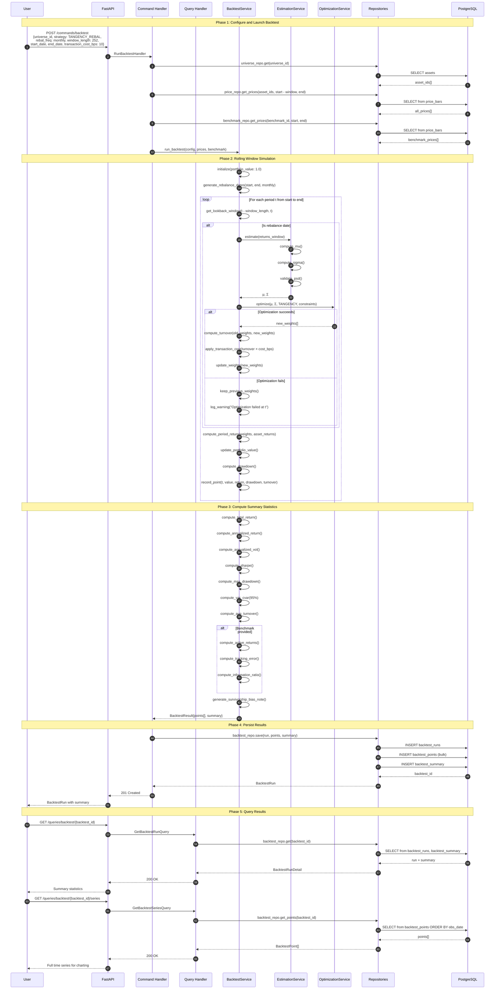

### Backtest State Machine

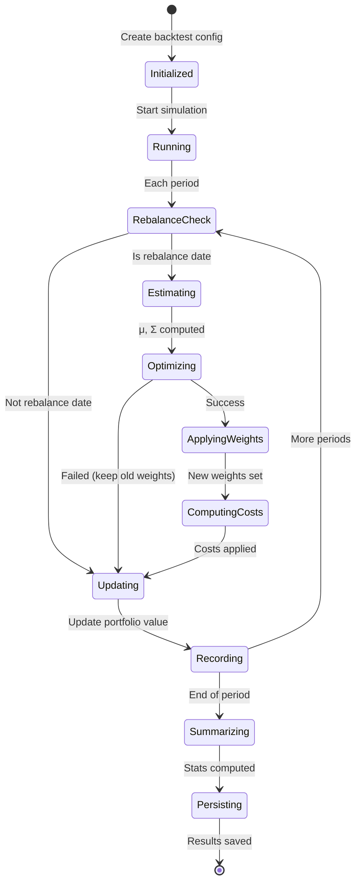

### Metrics Computation

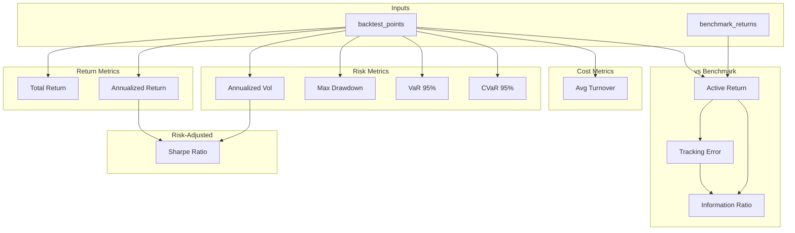

---

## Error Handling Patterns

All workflows follow consistent error handling:

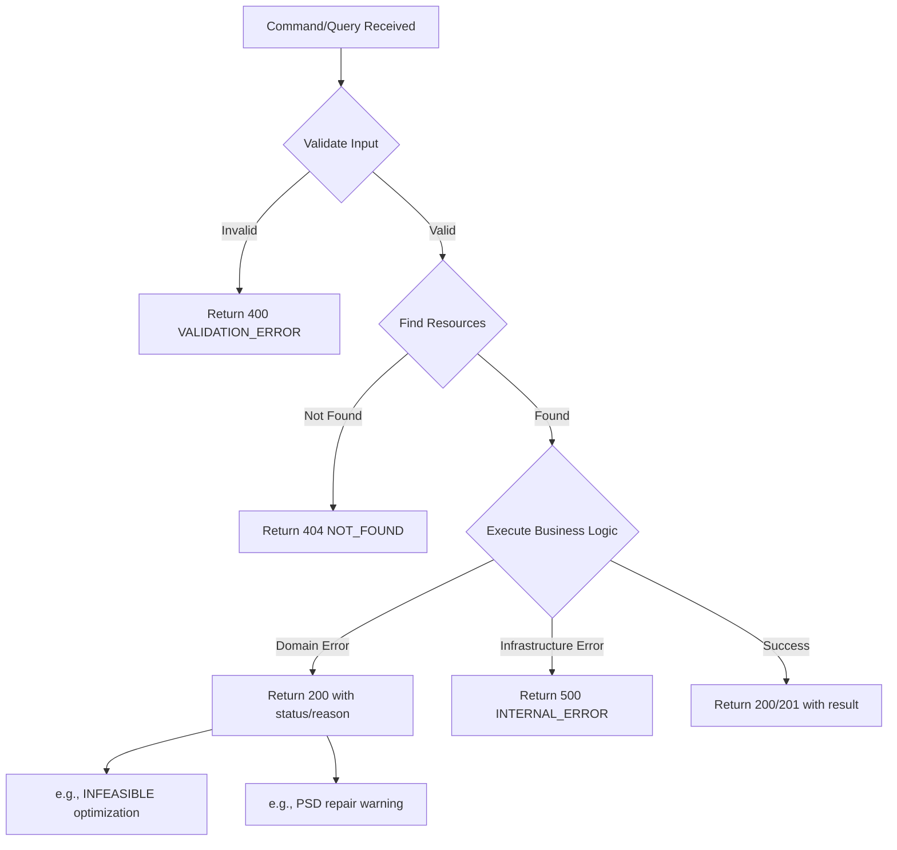

### Error Categories

| Category | HTTP Status | Example |
|----------|-------------|---------|
| Validation | 400 | Missing required field |
| Not Found | 404 | Unknown assumption_id |
| Conflict | 409 | Duplicate ticker |
| Business Logic | 200 | Optimization infeasible (status in body) |
| External | 502 | Vendor API timeout |
| Internal | 500 | Unexpected exception |

---

## Cross-Cutting Concerns

### Audit Trail

Every command persists:
- Timestamp
- Input parameters
- Output identifiers
- Status/errors

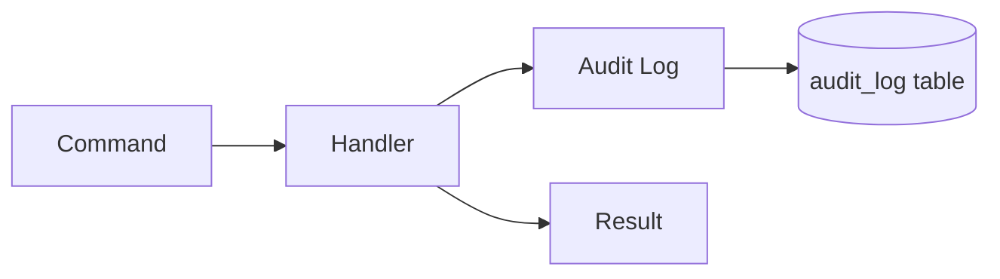

### Idempotency

Commands that create resources use client-generated UUIDs where possible, enabling safe retries:

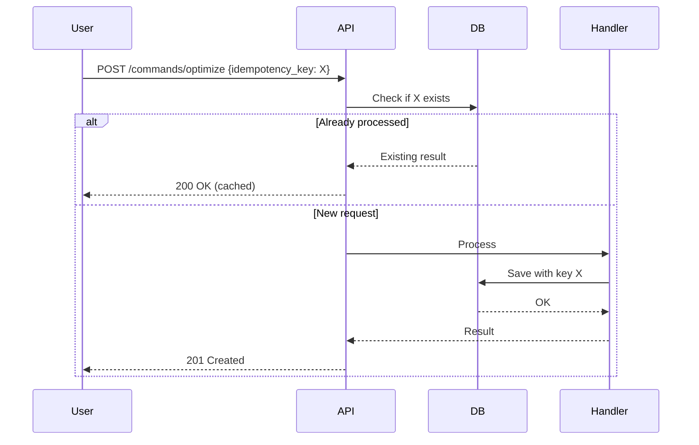

### Transactional Boundaries

Each command executes within a single database transaction:

```python
# commands/optimization.py
async def handle(self, request: RunOptimizationRequest) -> OptimizationRun:
    async with self._db.transaction():  # Single transaction
        assumptions = await self._assumption_repo.get(request.assumption_id)
        result = self._optimizer.optimize(assumptions, request.constraints)
        run = await self._optimization_repo.save(result)
        return run
    # Commit on success, rollback on exception
```
